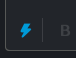
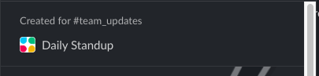
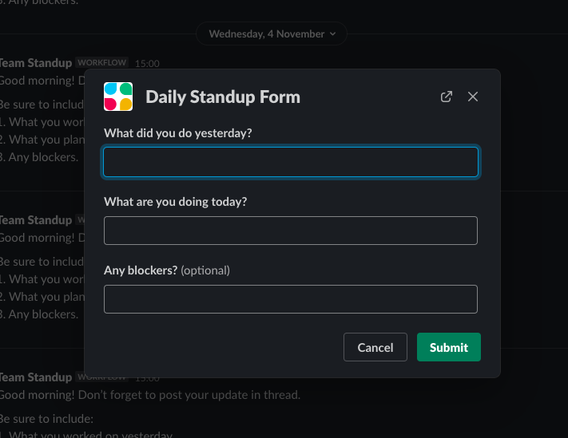
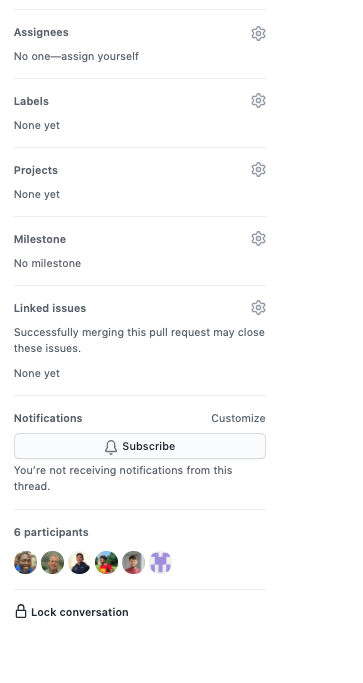
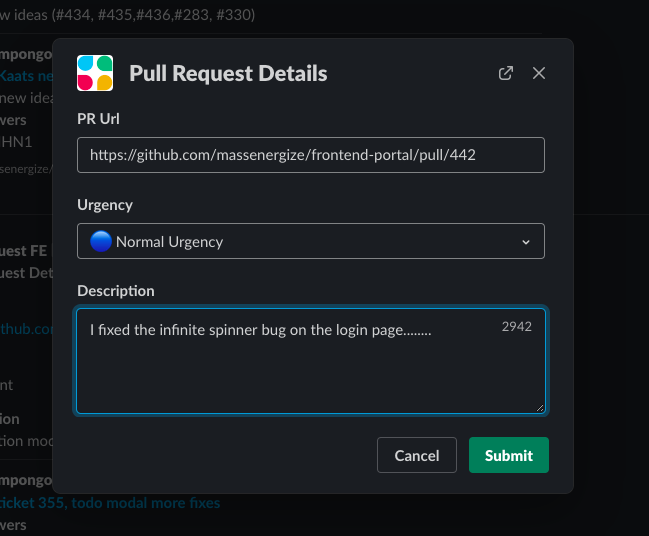

## Getting Started In MassEnergize As A Frontend Developer
On this board, you will find all the necessary information needed to get started as a developer with making changes and building on anything on the **MassEnergize**
user portal **(Made with React)**. This board will give directions to very tricky, and important files as well as details that make up the core functionality of the whole site. 
  Mind you, the information here is in no way going to take anyone through a **React**, it is just to document the structure of everything, where to find core files,
and simple instructions to how to use custom components that have been created.

### TABLE OF CONTENT 
* <a href="#file-to-page"> Which Files Show What Page? </a>
* <a href="#setting-your-env"> Configuring Your Working Environment(is_prod,is_local,is_canary, is_dev, is_sandbox) </a>
* <a href="#developer-workflow"> ME Developer Workflow and Push Protocol</a>
* <a href="#"> What To Know About ME Custom Components </a>
* <a href="#"> What Logic Makes Each Page Tick! </a>
* <a href="#me-board-flow"> ME Project Boards And What They Mean </a>

#### <a name="file-to-page">WHICH FILES SHOW WHAT PAGE </a>
 **Page** | **Related Files** 
 ---------| ----------------- 
<a href="https://community-dev.massenergize.org/">Community Selection Page</a> | `CommunitySelectPage.js`
<a href="https://community-dev.massenergize.org/wayland/">Homepage</a> | `Homepage.js`, `WelcomeImages.js`, `IconBoxTable.js`, `EventHomepageSection.js`
<a href="https://community-dev.massenergize.org/wayland/actions">All Actions Page</a> | `ActionsPage.js`, `Cart.js`, `Funnel.js`
<a href="https://community-dev.massenergize.org/wayland/actions">Action Cards On Actions Page</a> | `PhotoSensitiveAction.js` `ChooseHHForm.js`
<a href="https://community-dev.massenergize.org/wayland/actions" target="_blank">Individual Action Page</a> | `OneActionPage.js` `ChooseHHForm.js`, `StoryForm.js`, `Cart.js`
<a href="https://community-dev.massenergize.org/wayland/teams">All Teams Page</a> | `TeamsPage.js`, `TeamsInfoModal.js` `TeamsStatsBars.js`
<a href="https://community-dev.massenergize.org/wayland/teams">One Team</a> | `TeamsInfoModal.js`, `TeamsStatsBars.js`, `MEModal.js`
<a href="https://community-dev.massenergize.org/wayland/services">All Service Providers</a> | `ServicesPage.js`, `Funnel.js`
<a href="https://community-dev.massenergize.org/wayland/services">One Service Provider</a> | `ServicesPage.js`
<a href="https://community-dev.massenergize.org/wayland/testimonials">All Testimonials Page</a> | `StoriesPage.js`, `StoryForm.js`, `Funnel.js`, `METestimonialCard.js`
<a href="https://community-dev.massenergize.org/wayland/testimonials">One Testimonial Page</a> | `OneTestimonialPage.js`
<a href="https://community-dev.massenergize.org/wayland/events">All Events Page</a> | `EventsPageReal.js`, `NewEventsCard.js`
<a href="https://community-dev.massenergize.org/wayland/events">One Event Page</a> | `OneEventPage.js`
<a href="https://community-dev.massenergize.org/wayland/impact">Our Impact Page</a> | `impactPage.js`, `Utils.js`
<a href="https://community-dev.massenergize.org/wayland/aboutus">About Us Page</a> | `AboutUsPage.js`
<a href="https://community-dev.massenergize.org/wayland/donate">Donate Page</a> | `DonatePage.js`
<a href="https://community-dev.massenergize.org/wayland/donate">Contact Us Page</a> | `ContactUsPage.js`, `ContactPageForm.js`
<a href="https://community-dev.massenergize.org/wayland/signin">Login Page </a> | `LoginPage.js`, `LoginForm.js`
<a href="https://community-dev.massenergize.org/wayland/signup">Registration Page </a> | `RegistrationPage.js`, `RegistrationForm.js`
<a href="#">All Redux Actions </a> | `userActions.js`, `pageActions.js`, `linkActions.js`
<a href="#">All Redux Reducers </a> | `reducers/index.js`, `linkReducer.js`, `pageReducer.js`, `userReducer.js`
<a href="#">Most Configuration Files </a> | `config.json`, `firebaseConfig.js`, `config/index.js`
 

### <a name="setting-your-env">CONFIGURING YOUR WORKING ENVIRONMENT </a>

**Clone the `development` branch onto your pc locally** 
**Then `npm install` to get started right away**
  
At the time of writing, there are **five** working environments available in MassEnergize. These environments dictate the the kind of data you have access to, and interact with from the backend. You are free to tweak your configuration settings and interact with the data as you wish.  
**_However, please note that PROD, and CANARY, are not your playground. You may switch to them ONLY to view how real data may look with any new changes you might have made; for all other tests, thats what local and dev modes are for!_** 
#### How do I switch?
Easy! kindly move into your `/config/config.json` file and make changes to the bolean values that correspond to the environment you would like to working in. The various combinations that create the working environments are as follows. 

Environment |IS_LOCAL |IS_PROD|IS_SANDBOX|IS_CANARY|
------------|---------|-------|----------|---------|
Development| `false` | `false`| `false` | `false`
Production | `false`| `true` | `false` | `false`
Canary | `false` | `false` | `false`|`true` 
Sandbox | `false` | `false` | `true`| `false` 
Local | `true` | `false` | `false` | `false`

Dont get excited yet. Before you switch to local and expect magic to happen, 
make sure you have followed <a href="https://massenergize.slite.com/p/note/KWfwNLonZsf4bfGD6CNcJq">this link on how to setup your local backend on ME </a> 
The other environments do not need any setup :fire:.  However, due to a recent change in our authentication system, you may not be able to send data to the backend because of token issues. You should set your environment up locally.

### <a name="developer-workflow">DEVELOPER WORKFLOW AND PUSH PROTOCOL  </a>
If you have not been assigned a ticket yet, enjoy your leisure moments as best you can, Kaat is probably creating a ticket for you as you read :rofl:. You will be assigned soon.
When you are assigned, here  are a few things to note.

**Slack Workflow Notification** 
Before you get started with any assigned tickets on github, or just randomly fixing non-ticketed bugs, notify the team! 
The first thing todo is to go to the <a href="https://github.com/orgs/massenergize/projects/3">community portal github board</a> and move the tickets you are currently working on from `Backlog or To do` into `in progress`.  
After, use the **team_updates** channel to do these:
Use the bolt icon  
 
Then select **Daily Standup** from the options as shown 
  
Now fill the form appropriately with what you have been up to, and what you intend to tackle, then submit. 

**PUSHING TO GITHUB**  
In no circumstance should you ever work directly in the development branch. You should always branch from the development branch and its adviced to give an appropriate branch name that describes what changes and enhancements that branch covers.  
The **`development`** branch always has the latest updates from other ME developers -- its best to branch from there.  
While the development branch is always up to date, the **`master`** branch just contains the codebase of the current deployment version of what is on the production website. The development branch is only merged into master when all vetted features are pushed to prod. 
 
**Done and ready to merge?**  
When you are done working and you are ready to make the team aware of your working features, here are the steps to take 
 
1. Make a `pull request` from your branch into `development`. 
2. Describe the changes that you are shipping to development in the pull request description box that github provides. 
3. Link the related tickets to the pull request. 
4. Then, invite `Brad` and `Sam` to review your pull request. 
_Linking issues and requesting reviewers attention can be done on the right pane of your PR interface on github_  

_**Please note that if Brad and Sam are not available, you are free to tag any other developers available that might be free at that moment to test your features**_
 

**Notify all on slack** 
Lastly, use the **bolt** icon in the  `frontend` slack channel to create a `pull request` notification for all, as shown below. 

You are all set now, enjoy your free time :confetti_ball: :rofl:

### <a name="me-board-flow">ME PROJECT BOARDS FLOW AND THEIR MEANINGS </a>

There are currently about 5 boards on the community portal project board on github. These boards are used to organize and indicate stages that issues have to go through in order to get fixed. 
Where developers && testers place tickets may indicate whether or not a bug or an enhancement is being worked on, an issue can even be worked on, or a feature is ready to be tested. 
The names and description of the available boards are as follows. 

1. Backlog 
2. To do 
3. In progress 
4. QA - Ready To Be Tested 
5. Validated - Ready To Be Shipped 

### Backlog 
This is where all the tickets are placed when they are first made. Everything starts here! 

###  To do 
When testers create tickets and they need an issue to catch a developer's eye, this is where it is found. Developers are supposed to finish off any available tickets on the **To do** board, before they move over to the **Backlog** to find any other interesting tickets. 

### In Progress 
When a developer is ready to work on a ticket they have been assigned to on the **Todo** board, the tickets  have to be moved from **To do** onto the **In progress** board -- this is also another way to notify the team of what is currently being worked on.
When the matters related to a ticket are fixed in code and ready to be merged, the developer has to **`close`** the tickets and leave them on the **In progress** board.  
_TIP: To avoid having to manually close all your tickets, just link the tickets to your PR, they will be closed when the PR is merged_

### QA - Ready To Be Tested 
When a PR is tested locally and then merged into development by **Brad** or any reviewer, tickets that passed  will remain closed. **Brad** will then deploy the development branch to the development website for other testers to test. After, he will then move the related closed tickets from the **In progress** board onto the **QA - Ready To Be Tested**.
When other testers go over the tickets and they fail, the testers open the related tickets again, while it is in **QA -....**. When that happens, github notifies the assigned developer right away to take another shot at the ticket. When the developer is ready to try again, the ticket has to be moved from **QA** back to **In progress**, for the process to repeat itself :fire: 

### Validated And Ready To Ship To PROD
In the case where all closed tickets pass testing, testers will move the cards from **QA-....** into **Validted And Ready To Ship To PROD** 
:confetti_ball:

