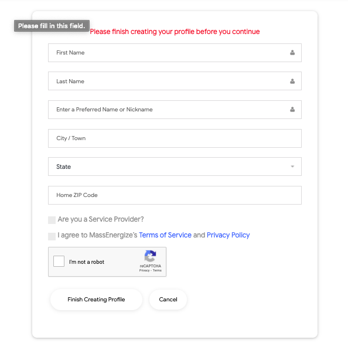

## SUMMARY 
Below are general summaries of various mechanisms that work to make the MassEnergize platform behave the way it does. You will be taken through the core concepts and logic behind different processes in a non-code format, to get you started with a mental picture of what is going on, before you delve into any part of the MassEnergize Code base. 

### TABLE OF CONTENT 
* <a href="#about-a-user">About A User</a>
* <a href="#login-and-registration">Login & Registration</a>
* <a href="#Todo-and-done">Todo And Done Mechanism</a>

### <a name="about-a-user">ABOUT A USER </a>
1. A massenergize user must belong to atleaset one community. However, they are able to join other communities through options on their profile page.  
2. A M.E user is able to mark an action as  **TODO** which will then show up on their todo list on the profile page. A user is able to mark as many actions as possible 
3. a M.E user is able to mark an action as **DONE** and will shop up on their profile page as part of a list of actions that have been completed.  
4. A M.E user is able to subscribe to an event within their community -- RSVP.  
5. A M.E user is able to join any team in their community, and as many teams as are available.  
6. A M.E user is able to request creation of a team via teams page.  

### LOGIN AND REGISTRATION 

**REGISTRATION** 
On ME, authentication is done with the help of **`firebase`** .   
A user is given two main options(more options in future) registration by normal email and password, and registration by using google popup.  
**Email & Password Registration** `RegistrationForm.js`   
A user is prompted to initially provide a working email, and password. On Submission, the information is shipped to firebase and authentcation object is sent back **onSuccess**.  
After, they are just sent to another form, to provide more details about themselves to be able to create a profile in the real ME database.  
*Refer to figure A* 
**Google SignIn**  
A user clicks on the red google button on the registration page and is immediately prompted by a google popup to choose which account they would like to use. When done, just like before, a json object that represents some authentication information about the just signed in user is sent back. With this, authentication with google has been successful, and they can go on  to provide more details about themselves.  
*Refer to figure A* 

**LOGIN**  
During sign in, whether email and password or google sign in, an authentication object is sent back from firebase onSuccess. 
The authentication object contains a token that is sent to the ME backend to retrieve any user that has that token. When the operation is succesful, ME backend sends back all the user's profile information, as well as a huge chunk of other data based on the kind of interactions they have already had on the site.  

